# BMW USA Redesign

[www.bmwusa.com](http://bit.ly/bmw-usa)  
October 2015–December 2016

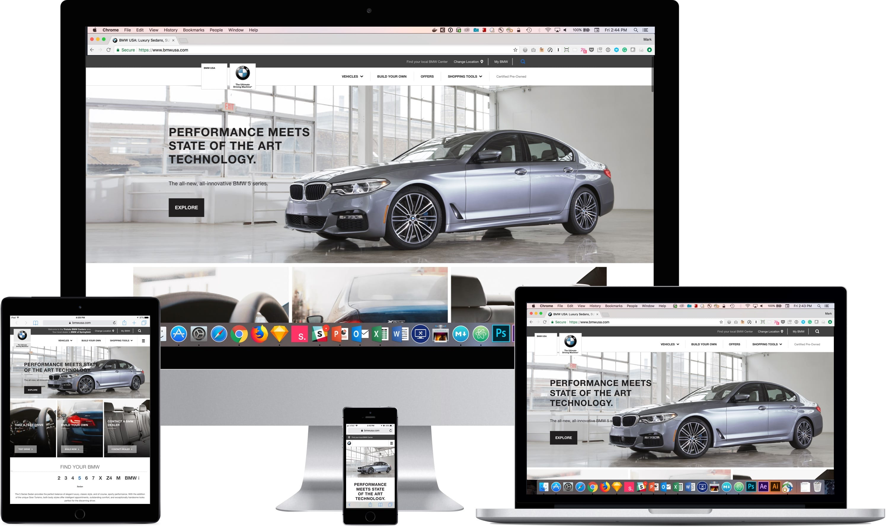

#### Responsive Redesign Case Study
During my tenure at KBS, the BMWUSA website was massive digital platform undergoing a significant multi-year redesign of its design and technology to address evolving car shopping behaviors.

This case study focuses on specific areas of the redesign where my UX leadership was involved in solving key areas of the user experience as well as improving team collaboration.

###### What I Did

* Created a **responsive design system** to be the foundation of our new platform
* Created a **modular system** to be easily and quickly updated with greater content flexibility than the current website
* Designed responsive modules that enabled **richer experiences** using **video**, **animation**, and **utility interaction**
* Built **repeatable modules** for **seamless implementation** and **reduced customization** while **creating consistency** for the user

###### Visit the [BMW USA](http://bit.ly/bmw-usa) Site

###### Skills | Deliverables
* UserTesting
* Sketches
* Wireframes
* Prototypes
* Design System
* Style Guide

###### Core Team
* **Mark Reilly** UX Lead
* **Emily Saraco** Visual Design
* **Ali Sajjadi** Product Manager
* **Adam Bettencourt** Scrum Master
* **Your Majesty** Front End
* **Keerthi Dundi** Back End

### Responsive Design System: Breakpoints

###### Approach
To build a foundational design system, I started by defining the breakpoints—a key ingredient of responsive design.

###### Solution
Rather than focus on device sizes, I established six *T-shirt* sized breakpoints. These roughly corresponded to current devices but were flexible enough to accommodate future device sizes.

Six breakpoints may seem excessive, but it allowed us greater flexibility. We didn’t need to create six different designs. The top three breakpoints shared the same orientation and aspect ratio, so we were able to scale up the **L** breakpoint design to fit the **XL** and **XXL** breakpoints.

We focused our design efforts on the smallest **XS** *mobile* breakpoint and the **L** *desktop* breakpoint. These two breakpoints informed our approach to the **M** *tablet* breakpoint; I either adapted one of those design patterns or created a new one.

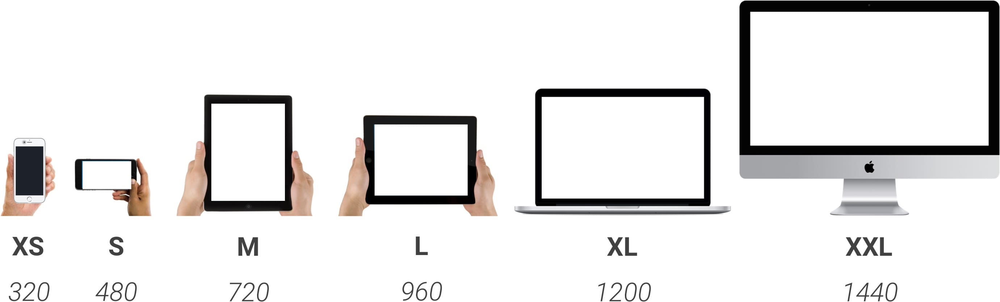
[caption]
We used T-shirt sizes to refer to the six breakpoints rather than devices. Of the six breakpoints, we focused designing three of them: **XS** *320*, **M** *720*, and **L** *960*.

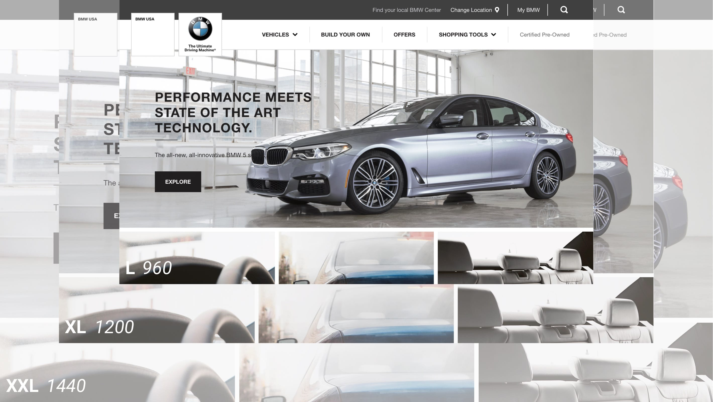
[caption]
The **3** largest sizes use the same design: The grid, images, and type scale up uniformly. The design at 960px scales up **125%** at *1200px* and then another **120%** at *1440px*.


### Responsive Design System: Fluid Grid

###### Problem
A second key ingredient of responsive design is a **Fluid Grid**. The existing homepage and product pages had tried to use a **12** column grid for their desktop viewport. Unfortunately, the developers had to add two columns to make that design work.

###### The Ask
The designers wanted to bring back a **12** column grid. As it is neatly divisible by **2**, **3**, & **4**, which gave them a lot of layout options—halves, thirds, and quarters.

###### Solution
To simplify the design I decided to create a standard column and gutter width. Each column would be *72px* wide with a *8px* gutter. Starting with **4** columns at **XS** *320px*. We add columns as the viewport gets larger: **6** columns at **S** *480px*, **9** columns at **M** *720px*, until we reach **12** columns at **L** breakpoint *960px*. When we reach the larger breakpoints **XL** *1200px* and **XXL** *1440px*. We scale up the grid & typography proportionally. This responsive fluid grid made it easier to translate patterns & assets across breakpoints.

###### View the CodePen [Demo](http://bit.ly/bmw-grid) of the Grid

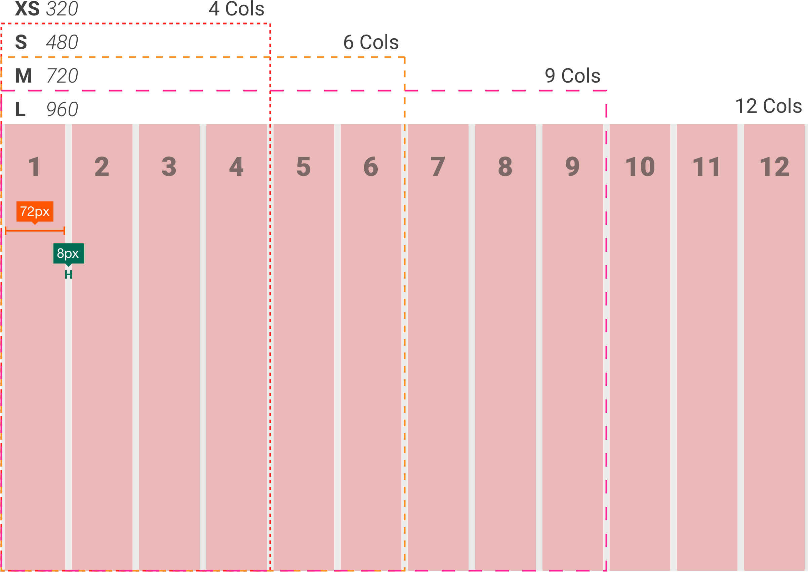
[caption]
The responsive fluid grid: when the viewport gets large enough we add columns. Starting at **4** columns at *320px* to a total of **12** columns at *960px*.

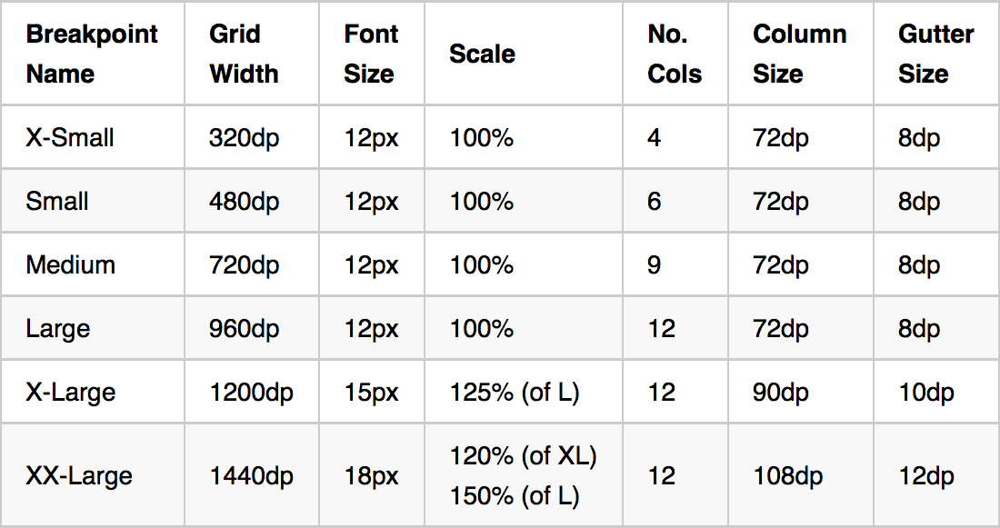

### Module Library

###### Approach
To help the visual design team adjust to the modular design system, we developed an easy to use **Module Library** to be their **Design Kit**. We organized our modular library using **Atomic Design** principles. Building from simple atomic elements into molecules and then more complex organisms or modules.

###### Solution
We started the module library with a rigorous content audit. We worked with a content strategist to evaluate the existing content and what was missing. We then organized the content into design patterns or modules. We defined layout options: text alignment, image placement, and dark or light themes.

We applied global styles to each module and described how the layout would adjust at each breakpoint. We started with the smallest breakpoint and made sure we had all the content and functionality that we needed. As we went up in size and had more space, we considered progressively enhancing the modules by adding images or functionality.

The module library reduced QA time considerably. We did an initial round of QA to make the modules functioned properly. Once they passed, we’d only need to QA them again for content.

###### View the CodePen [Demo](http://bit.ly/bmw-ma1) of a Module

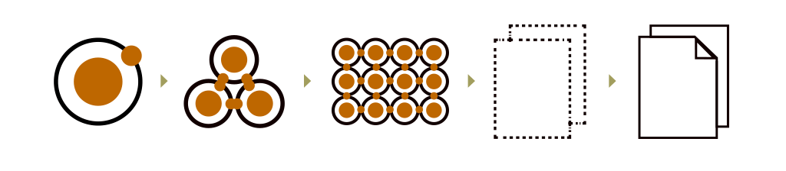

[caption]
**Atomic Design’s** five stages: *Atoms*, *Molecules*, *Organisms*, *Templates*, and *Pages*.

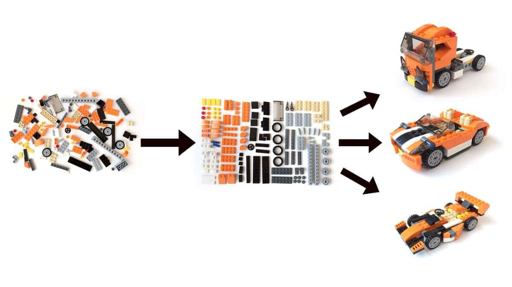

[caption]
Modular design approach began with a content audit. We organized the content and established design patterns. We then used these modules to build any page.

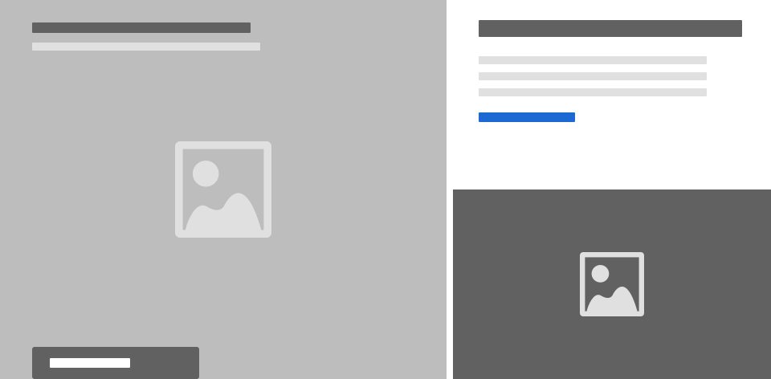
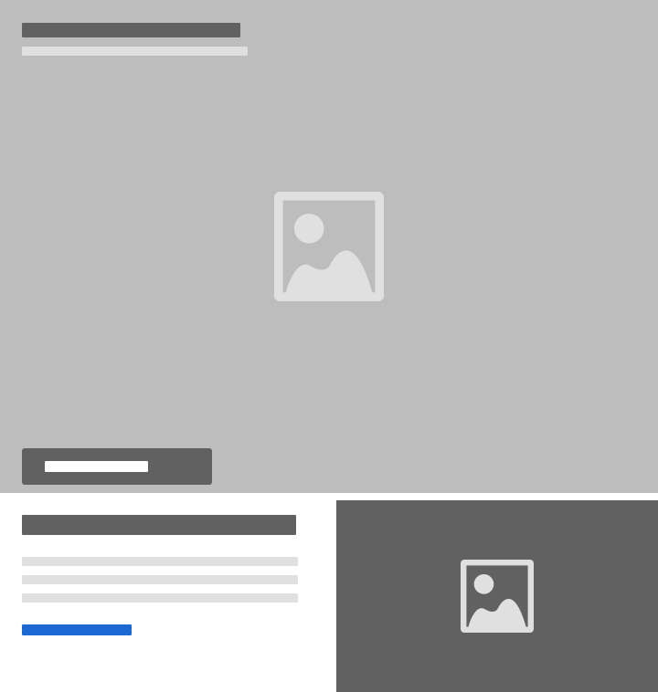

[caption]
**L** **M** **XS**

### Modular Design for the Homepage

###### Problem
The BMW USA homepage needed to support **three** very different narratives at different times of the year: **Sales Events**, **Vehicle Launches**, and **Brand Events**.

##### Approach
For each event type, we **determined** the **goal** of the page. We created a **content hierarchy** that enabled the user to fulfill that goal and used our **module library** to build the page.

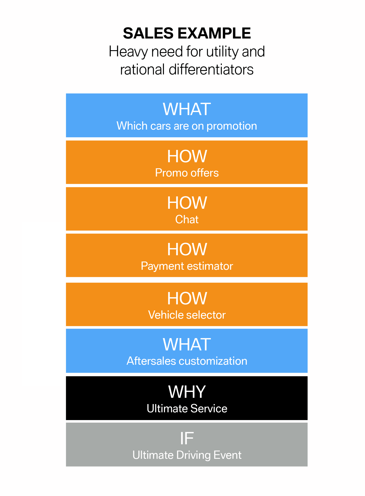

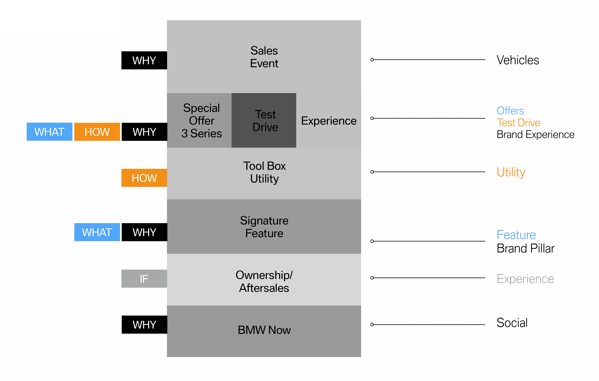

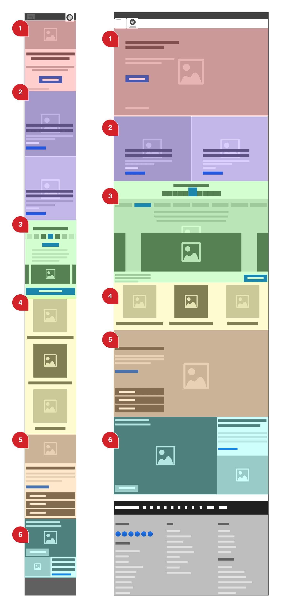

### Module Example: Homepage Marquee

###### Approach
The homepage marquee area is intended to be a singular, impactful experience. It is the standard bearer for the full site experience, and it was vital that it was consistent across devices.

###### Solution
We wanted to make a very versatile module: One that could hold a single image, or a carousel, or a video in the background. We added options for aligning the text to the left, right, and center, allowing us to work with a broader range of photos.

This module was designed to be on the top of the homepage beneath the main navigation. On larger screens, it was intended to be above the fold and reveal the top of next content piece.

For desktop, I chose a wide aspect ratio of **16:6**. However, on mobile, it was too short. I decided to use the new **<picture>** element and create three crops to use them at different breakpoints: Allowing us to use a **16:9** image for small screens and a wider ratio of **16:5** or *full bleed* on the largest screen.

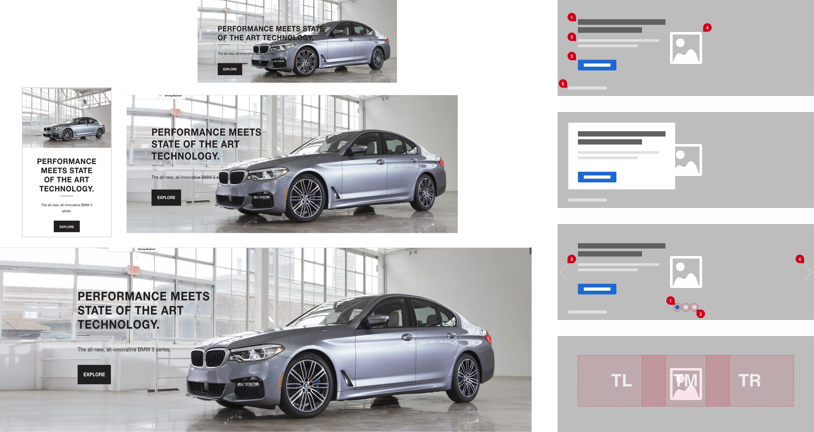

[caption]
The homepage marquee in action: **M** *tablet*, **XS** *mobile*, **L** *laptop*, and **XXL** *desktop HD*. Wireframes show variations such as a carousel, text box, and text alignment options.

##### The Outcomes
* The modular redesign of the BMWUSA.com rolled out in **phased releases** in the **last quarter** of **2016** and the **first quarter** of **2017**
* The new **Adobe Experience Manager** platform **replaced two older platforms**; the CMS for the product pages and the mobile-only site
* **Mobile traffic** increased **216%** and **surpassed desktop traffic** in **March 2017**
* The **Series Selector** on the homepage had **82% increase** in clicks in **March 2017**
* **Smooth hand over** of design, code, and documentation to **BMW’s new agency** responsible for maintaining the website

##### My Role
* **Lead** user experience designer on **BMW redesign**
* Created and documented the **modular design system** and wireframes for the **module library**
* Designed and prototyped the **responsive grid**
* Redesigned **navigation** to be responsive
* Designed the new **forms** and **dealer locator**
* **Quality control** for all visual and interaction design launched on the new platform
* **Oversaw** all other user experience projects on the new platform
* Oversaw all **user testing** for BMW
