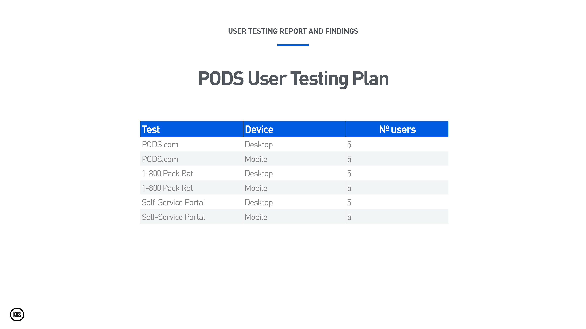
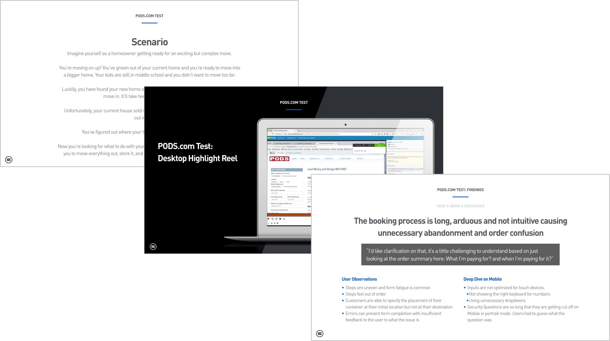
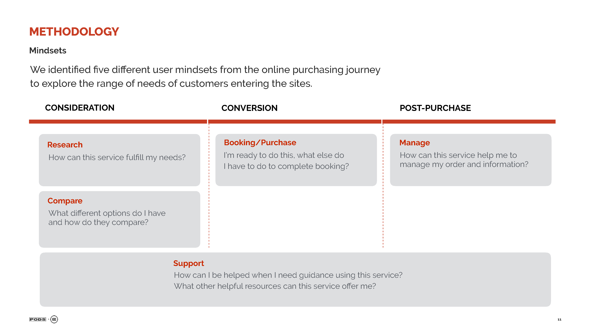
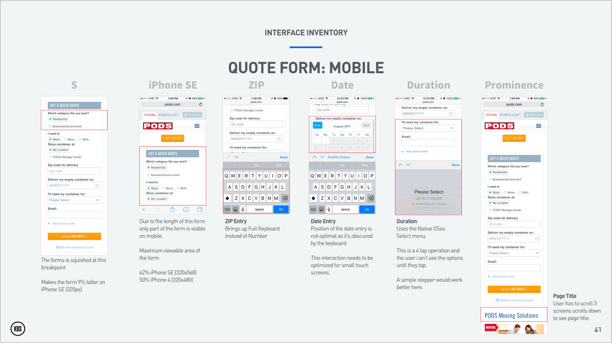
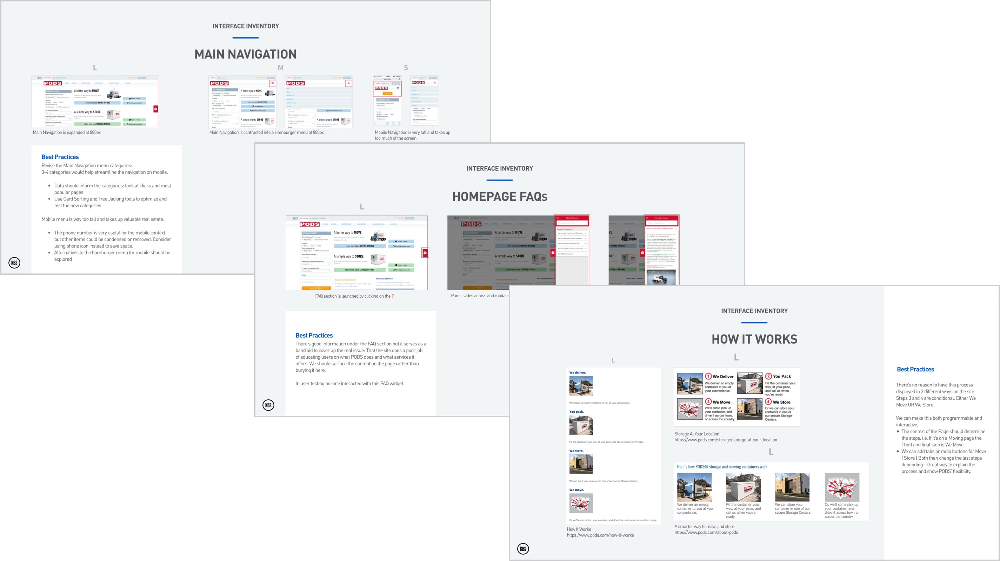
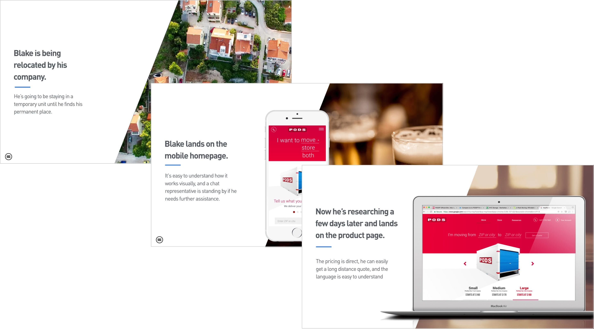
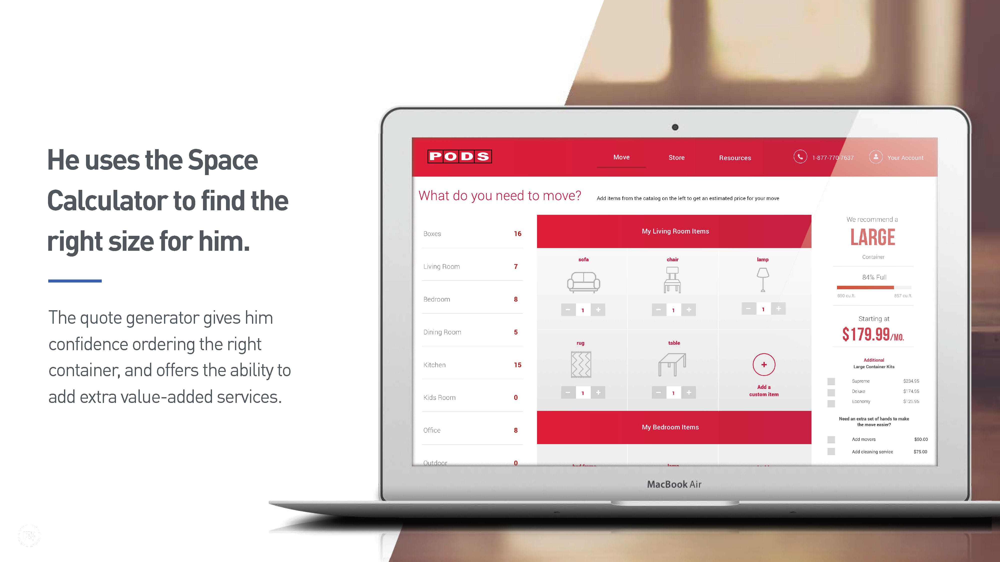

# PODS: Discovery

[www.pods.com](http://bit.ly/PODS-homepage)
July 2017–October 2017

#### Discovery Case Study

PODS came to KBS looking for a recommendation to improve their website and their digital strategy. We set up a multidisciplinary team to research their digital properties and make a recommendation.

We looked at the PODS organization as a whole, conducting stakeholder and user interviews at PODS' headquarters in Tampa. We talked to people from IT, Marketing, Customer Service, and some PODS drivers. We did rounds of user testing on their sites and looked at their competitors' sites.

### UX Audit Report

* Conducted **Usability Testing**
* Oversaw a **UX Competitive Audit**
* Created an **Interface Inventory**
* Developed User **Personas**
* Wrote the UX section of the **PODS Vision** presentation

###### Visit the [PODS Homepage](http://bit.ly/PODS-homepage)

### Skills | Deliverables

* User Testing
* User Interviews
* Competitive Analysis
* Personas
* Sketches
* Wireframes

### Core Team

* **Mark Reilly** UX Lead
* **Tom Kozlowski** Product Strategist
* **Jeff Gray** Engineering
* **Dom Brown** Brand Strategist
* **Michael Furst** Brand Strategist
* **Katie McNish** Producer

## Usability Testing

### Testing Plan
I wanted to test the user experience and the usability of the PODS site. I needed to observe users using it on laptops and smartphones as it was a responsive design.

I also wanted to test a close competitor’s website to see what they were doing. Finally, I looked at PODS Self Service Portal, where customers can log in to update when and where their containers are delivered and to make payments. I wrote test scripts and scenarios and found users through usertesting.com.

### High-Level Findings
* Users had a hard time learning what PODS offered
* The site steered users to get a quick quote before explaining the value of their service versus their cheaper competitors
* Users had trouble understanding how much of their stuff could fit in a container and exactly how many containers they’d need
* On smartphones, all of these issues were greatly exacerbated
* The close competitor was doing a better job on the desktop but suffered similar problems to PODS on smartphones

[caption] We created three tests and tested each on desktop and smartphones.

[caption] Highlight video reel.

[caption] Test scenario recap.

[caption] Findings report per tasks of each test.

## UX Competitive Audit

### Methodology
We evaluated direct competitors to understand what cross-shopping customers were seeing. We also identified patterns from best-in-class websites which PODS could adapt to go beyond their competitors.

* Seven direct competitors
* Seven best-in-class websites

We conducted an expert UX walkthrough for each site, assessing the desktop and mobile experiences according to user mindsets. We based our assessment on a set of heuristics and performance criteria identified for each mindset.

### High-Level Findings

* Most moving and storage brands offer mediocre websites that fail to deliver seamless, intuitive, and relevant experiences online.
* As customers go through the online purchasing journey, brands are creating obstacles instead of guiding users smoothly through the process
* PODS has an opportunity to leapfrog its competitors by offering them a superior digital experience.

[caption] We looked at three different user mindsets: consideration, conversion, and post-purchase.

[caption] Oscar Health: out of category inspiration.

[caption] Overall scorecard of direct competitors.

[caption] Heuristics we used to evaluate competitors.

## Interface Inventory

### What is it For?
The interface inventory was a preliminary audit of the PODS.com user interface. It lays the groundwork for our future design system and module library.

I looked at the site on mobile, tablet, and desktop which roughly correspond to their small, medium, and large breakpoints. I documented their existing design patterns and how they reflowed at the different breakpoints. I added best practices for each section based on observations from testing and expert analysis.

### Key Findings
I used the *Wayback Machine* to look at earlier designs of the PODS website. The current version was designed first for the desktop. The redesign focused on modernizing the look of the user interface. The information architecture and layout of the site hadn't been revised from the previous version.

At a later date, there was a responsive retrofit, which added two breakpoints for tablet and smartphones. Essentially making the desktop design fit better on these devices without redesigning the information architecture, interactions, or hierarchy to be better suited for these devices.

[caption] I looked at the quote form widget on mobile as this is a key interaction with users.

[caption] Main navigation: at the three breakpoints.

[caption] Homepage FAQs.

[caption] The How It Works has three different designs.

## Personas

### How We Created Them
The user personas are a composite drawn from user interviews, observations during user testing, and customer segmentation and demographics that were provided by PODS' marketing department.

These personas reflected the four major user journeys that PODS customers take. If they’re moving locally or long distance, or if they need short term or long term storage, or even a combination of both. It’s this flexibility and control that sets PODS apart from its competitors. Each persona represents a different set of traits and behavior patterns, tied together by a common perspective.

### What They’ll Be Used For
These personas will inform our prioritization of what we will build on the new site. We’ll use them as a lens to help prioritize and sequence features.

Personas help us build empathy for our users and their goals. They help us focus on what’s important to help them achieve their goals. They encourage the team and the stakeholders to form a consensus on what’s important. They inform us and enable us to make and defend our design decisions. We can utilize them to measure if we have created the right solutions for our users.

[caption] Janine is moving across town but needs to store her stuff until her renovation is over.

[caption] Long-distance mover.

[caption] Long-term storer.

[caption] A long-distance mover with storage needs.

## PODS Vision: UX Section

### Working Towards a Solution
At the end of the discovery phase, we reported our findings. We were able to show them, not only did we understood their problems, we had solutions.

### Blake’s Story
We worked on a **PODS Vision** presentation outlining where we saw PODS could be in two years time. We used one of our personas—**Blake**—to show how, in the future, we would help him achieve his goals. He’s moving across the country for work. He’s living in temporary accommodation and doesn’t know where he wants to buy yet. He’s planning on storing his stuff in the interim.

He will be able to use the site on his smartphone and his laptop seamlessly. He starts on his smartphone and quickly assesses that PODS could work for his complicated move.

A few days later, he’s back on the PODS site researching what size container he’ll need. He uses the new **Space Calculator** to help figure this out. Once he’s added all his stuff, PODS can also send him with the right amount of moving supplies. He can even request some help packing up his stuff.

[caption] Blake needs to move.

[caption] He checks out PODS.

[caption] He’s exploring what products PODS offer.

[caption] Using the new Space Calculator, he enters in his stuff and finds out what size he needs.

### The Outcomes
* **We won** the business—**$2.9M**—for the **2018 PODS redesign** at the end of October
* Presented the **PODS Vision** presentation in early October
* Delivered the **UX Discovery** report as a standalone report at the same time
* Outlined **quick wins** for the existing site to improve user experience **before the redesign**

### My Role
* Conducted and analyzed **three rounds** of **user testing** on both desktop and mobile
* Created the **interface inventory** and **personas**
* Oversaw the **competitive audit**
* Created **wireframes** for PODS future state screens in the **PODS Vision** presentation
* Wrote the final **UX Discovery** report
