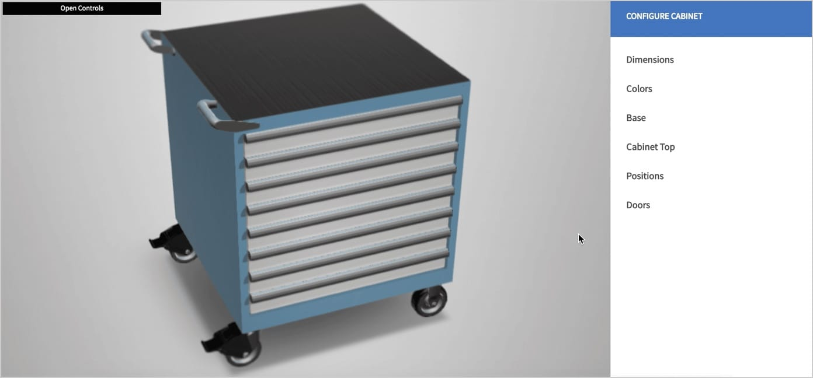
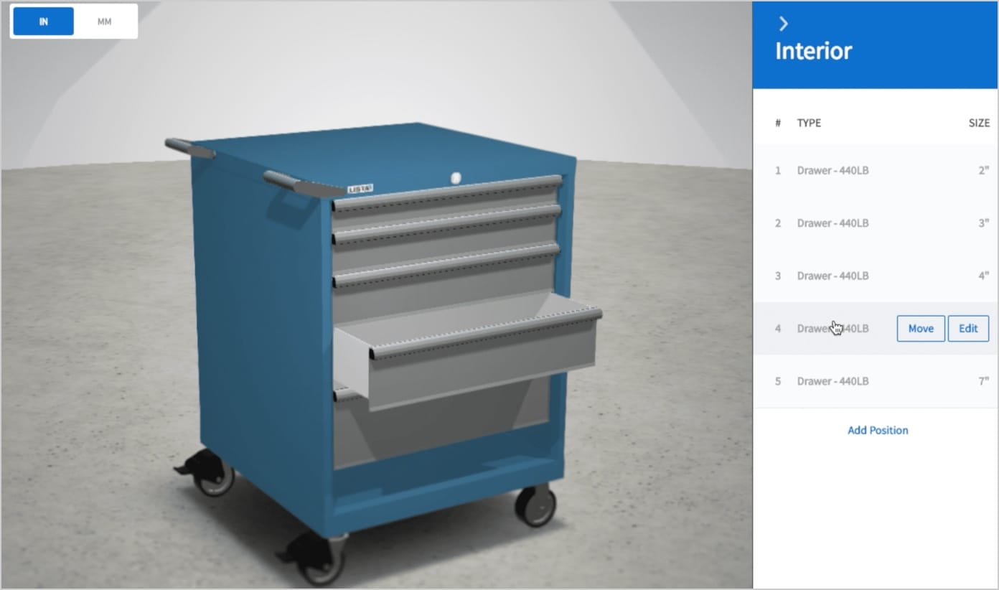
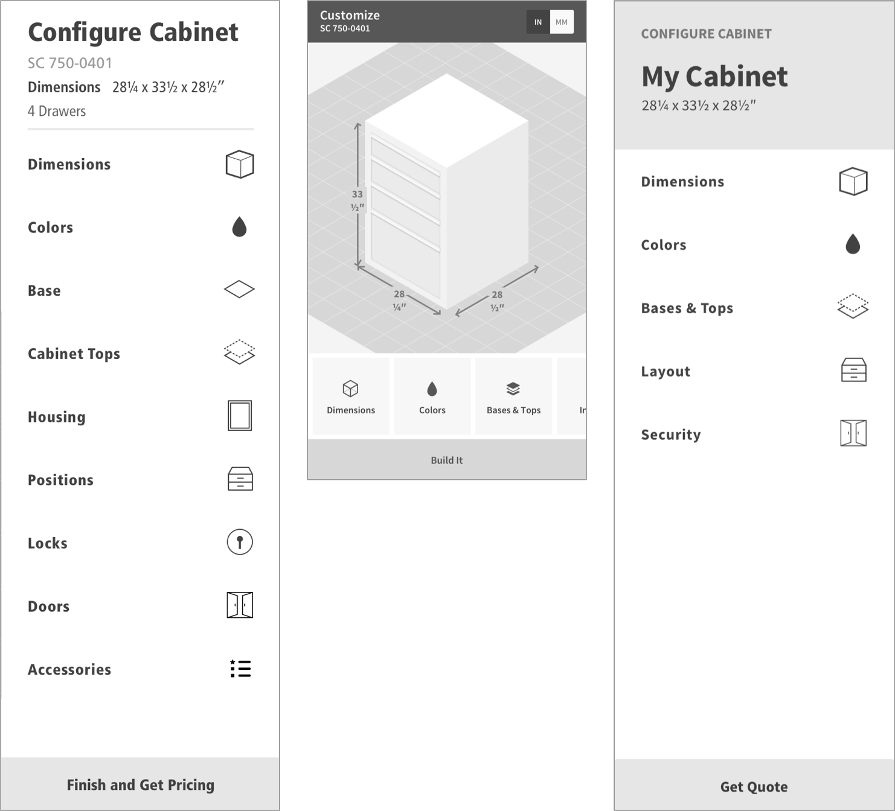
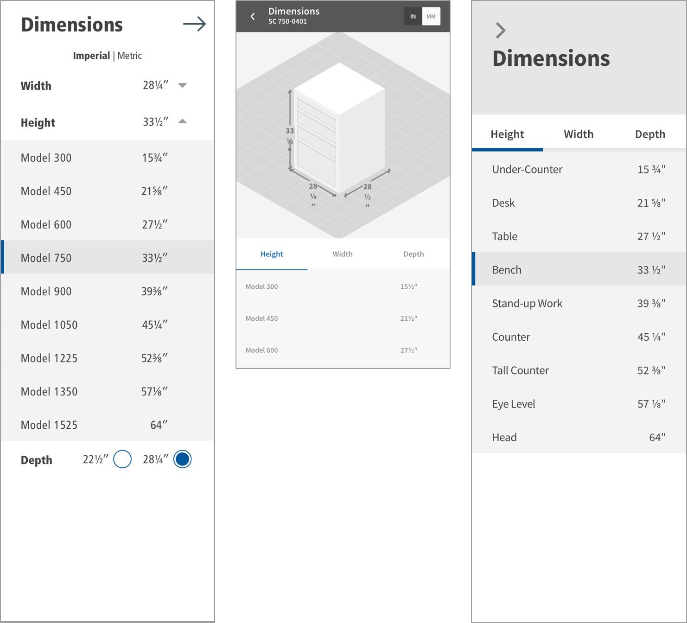
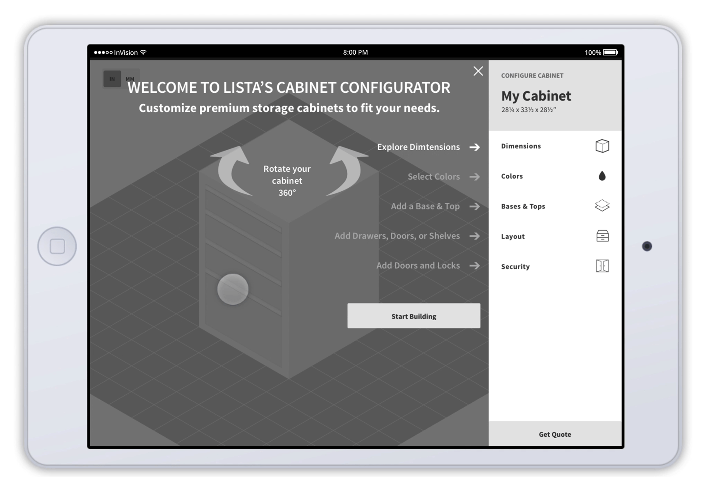
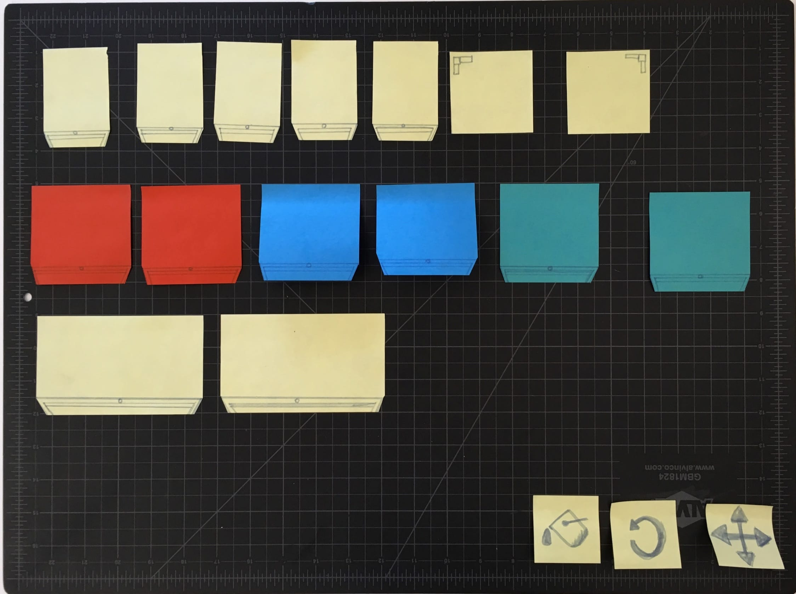
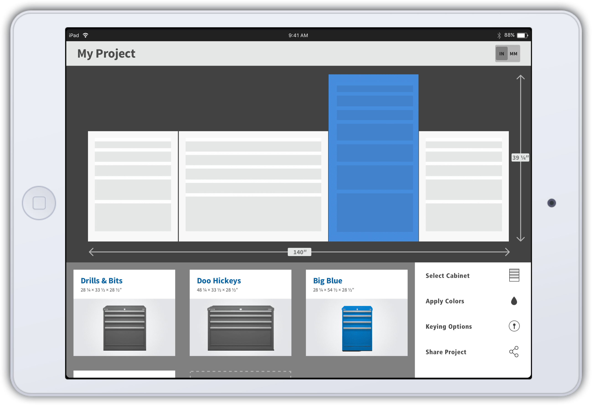
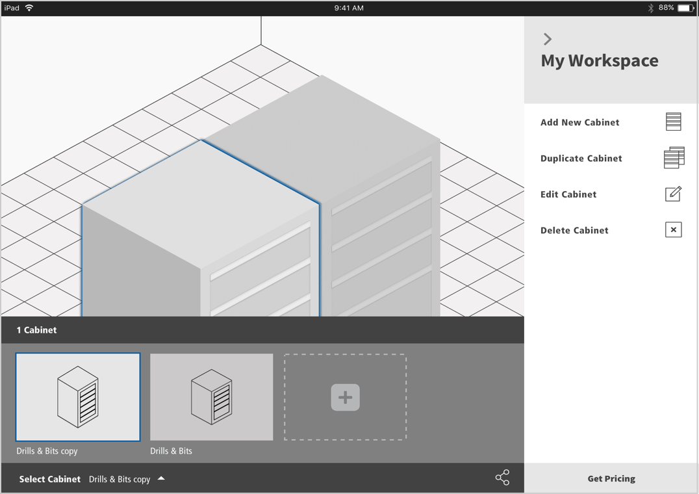
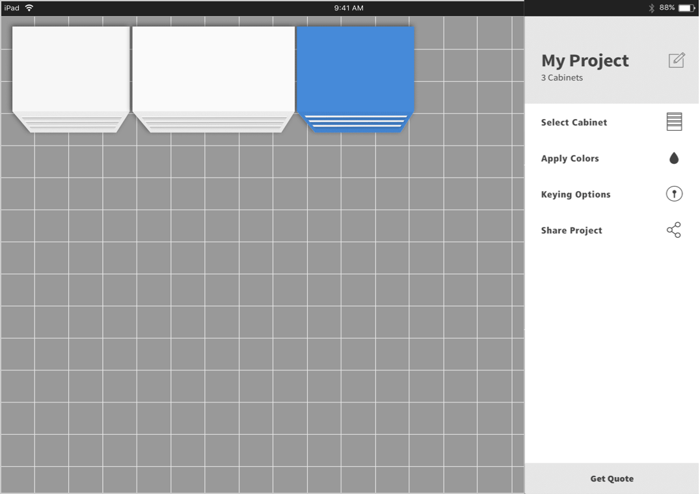
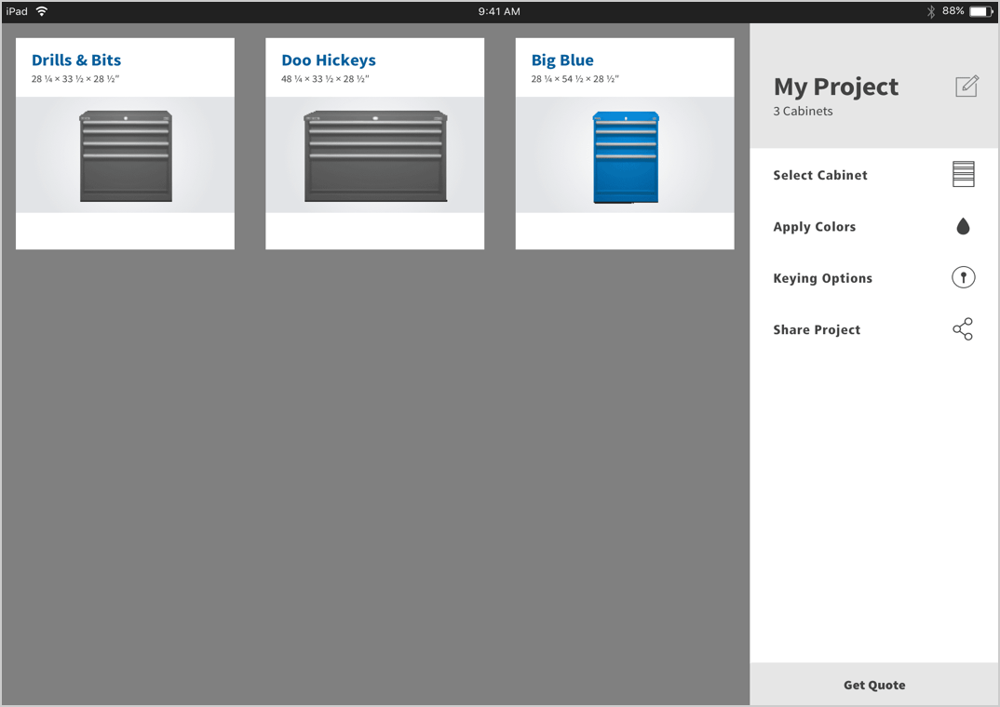

# Stanley Black & Decker: Cabinet Configurator

[www.storageconfiguration.com](http://bit.ly/SBD-Cabinet)
February 2017–August 2017

<video width="100%" muted playsinline>
  <source src="videos/SBD--Configurator__Demo.mp4" type="video/mp4">
  
</video>

## Responsive Web App Case Study
To help users create custom metal cabinets, we built a web app for Stanley Black & Decker’s *Lista* brand. We designed the web app for reuse across five other SBD’s brands that sell metal cabinets.

This case study focuses on the execution phase of the project. How we took our extensive research from the discovery phase of the project and built a key prototype. We iterated on the prototype, released a minimum viable product, then a version 1.5 to the public.

### What We Did
* **Synthesized** our discovery findings
* Worked as a **multidisciplinary agile team**
* Created and iterated on a **design system**
* Designed a **working code prototype** in 10 weeks
* Conducted rounds of **user testing**
* Refined the prototype for a **1.0 release**
* Designed new features for the **1.5 release**

##### Visit the [Cabinet Configurator](http://bit.ly/SBD-Cabinet)

### Skills | Deliverables

* User Testing
* Sketches
* Wireframes
* Prototypes
* Design System
* Flow Diagrams

### Core Team

* **Mark Reilly** Assoc. Director UX
* **Chase Farnum** Design Director
* **Adam Frederick** Product Manager
* **Michelle Esposito** Scrum Master
* **Scott Nash** | **Phaedra Riley** Front End
* **Eduardo Silva** Back End Lead

## Mapping the Functionality

### Discovery
In the discovery, we’d talked to SBD stakeholders and customers. We had uncovered key features and functionality that these users would need. The next step was to sort and map out where these features could exist and create a system.

There was an existing configurator on the site, originally built as a tool for salespeople to place cabinet orders, it was not intuitive or user-friendly. It did give us a baseline for what features had to be in the new configurator, but we needed to figure out the system.

I realized that we’d need three critical areas within the system: an area to be the entry point for new users; an area to configure cabinets; and an area to store multiple cabinet configurations.

### Site Flow Map
I created a **site flow map** to figure this out — it’s a hybrid of a **sitemap** and a **user flow**. With the system mapped out we were able to write user stories for these areas and the functionality they’d need. The site flow map helped us prioritize the functionality within the configurator and how it would fit into the product roadmap.

[caption] Site flow map: showing how new and returning users would enter the configurator.

[caption] Close up of the configurator section showing the essential functionality and options.

## Building a Working Prototype in 10 weeks

### Problem

Our first design constraint was we needed a working prototype to present at an important board meeting in mid-April. For the sake of this key demo, I decided that we had to forgo our mobile-first design philosophy and design the desktop first.

After numerous client presentations, I’d realized that while designing for mobile first was a best practice for prioritization of information; it made for a poor demo. It was much harder for stakeholders to understand the mobile experience when you show it on a large screen. I found it was always better to show the desktop experience and then the mobile—or better yet to create a prototype and load it onto an actual mobile device.

### Solution
* I built a comprehensive UX prototype in InVision: mapping out all of the key interactions and components
* Two Front-end developers iterated on a prototype
* One focused on the user interface
* The other on the 3D rendering of the cabinets

##### View the UX for the [First Prototype](http://bit.ly/SBD-prototype-board)

<video width="100%" muted playsinline>
  <source src="videos/SBD_Configurator_1st-Prototype_1080.mp4" type="video/mp4">
  
</video>

[caption] UX InVision prototype 3/23/2017

[caption] Dev prototype: Sprint 1 – 3/10/2017

[caption] Dev prototype: Sprint 2 – 3/21/2017

[caption] Dev prototype: Sprint 3 – 4/10/2017

[caption] Dev prototype: Sprint 4 – 4/21/2017

## Menu Iterations

### Mobile Menu Design
Once we’d successfully demoed our prototype, we took our desktop-centric design and rethought it for a mobile context. We had already designed for touch interfaces, but the constraints of mobile made us reconsider some of our components.

On mobile, it was important for our users to be able to see the changes while they were interacting with the user interface. We want the menu to use less than 40% of the height of the screen.

The most significant change to the user interface was to replace the accordions with tabs. Tabs made better use of the space on mobile and allowed users to see what options were available without having to expand them.

### Reducing Menu Items
Tabs made sense for the mobile design and performed better in user testing. When I switched to tabs from accordions, I also revised the categories in the main menu of the configurator. By using tabs, I was able to group similar items. I was able to reduce the number of menu items on the main menu from nine to five.

[caption] Main Menu: Prototype, Mobile, Version 1.0

[caption] Height Menu: Prototype, Mobile, Version 1.0

## Release 1.0: Configuring a Single Cabinet

### User testing
We did user testing on their existing configurator and the prototype. Users failed to build a cabinet in the current configurator. The controls and labels were confounding to many of our test users. The prototype performed much better, and users were able to complete building their custom cabinet.

In the prototype, we noticed where we used accordions they were sometimes overlooked. Where we had tabs, users saw all the options right away. We revised the user interface, and tabs became the dominant design pattern.

### Getting to a 1.0 release
For the demo, we used hard-coded data to populate the screens. We now had to build an API to provide real data. The API also served as the rules engine. The rules engine informed the user when there was a conflict between the options they had chosen and offered solutions on how to fix that issue.

We decided that we’d launch the new configurator with the ability to configure one cabinet at a time and get a summary. I added annotations to the UX prototype to document these interactions.

##### View the [UX: Release 1.0](http://bit.ly/SBD-prototype-1-dot-0) prototype

[caption] While user testing the prototype: we found that tabs worked better than accordions.

<video width="100%" muted playsinline>
  <source src="videos/SBD_Configurator_1.0-UX-Desktop_1080.mp4" type="video/mp4">
  
</video>

[caption] InVision prototype of the UX. It was used to help document the 1.0 release.

## Release 1.5: Configuring Multiple Cabinets

### My Project Space
To configure more than one cabinet at a time, we needed an area where users could access the configurations of all their cabinets.

This area became the **My Project** space. We wanted to users to be able to visualize their cabinets and get a sense of their sizes next to each other. We wanted them to be able to perform some global actions on all of their cabinets: changing colors and setting keying options. Users can share their projects with others for review. Users can now get a quote based on their project with one or more cabinets.

### Multiple Iterations

We went through **4** major iterations to get to this solution

* **3D view** with a **tray** to switch between configurations
* **Overhead 3D view** where you could move the cabinets around
* **Overhead view** with **tiled images** of the cabinets
* Using **Cards** where we could show supporting information

After exploring each of these iterations, we ended up using a **wall planning view** on the top and a **card view** on the bottom.

##### View the [UX Prototype — 1.5](http://bit.ly/SBD-prototype-1-dot-5)

<video width="100%" muted playsinline>
  <source src="videos/SBD_Configurator_1.5-UX-Desktop-1080.mp4" type="video/mp4">
  
</video>

[caption] My Project: wall planning feature with cards below.

[caption] Alternative 1: 3D with Tray

[caption] Alternative 2: Overhead 3D

[caption] Alternative 3: Overhead tiles

[caption] Alternative 4: Cards

### The Outcomes

* Successfully created a **working prototype** for the board presentation in **April 2017**
* Launched **version 1.0** of the configurator—a stealth beta launch to stakeholders—in **August 2017**
* Launched **version 1.5** to the public in **October 2017**
* **Version 1.6** released in **November 2017**

### My Role

* **Lead** user experience designer on **SBD**
* Designed the extensive **InVision prototypes** for the prototype and each release
* Devised and documented the **design system**
* Led **ideation workshop** with the client & the team
* Conducted **user testing** on the existing Lista configurator, the new prototype, and the beta
* **Oversaw** the user experience project for **another SBD brand** *Mac Tools* who are using this new configurator engine
